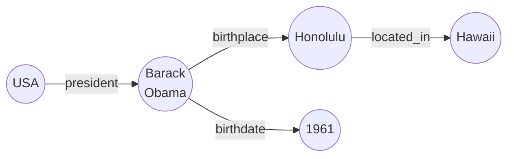
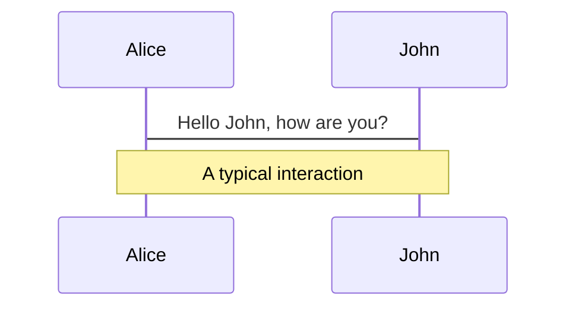
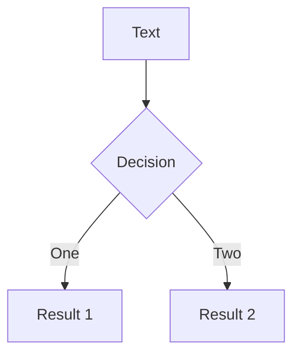
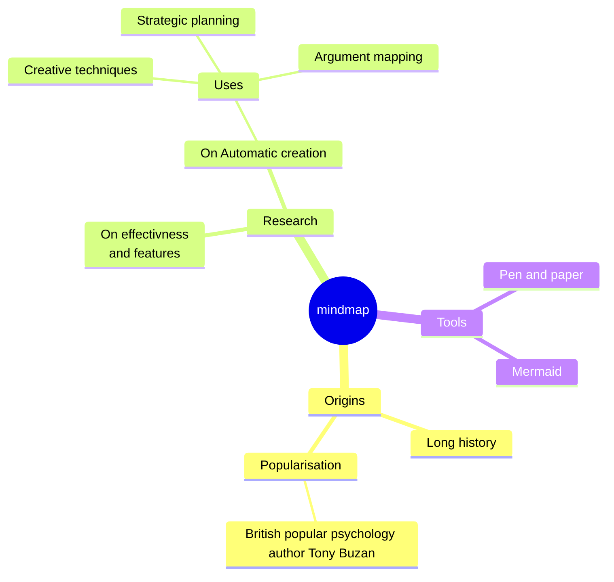
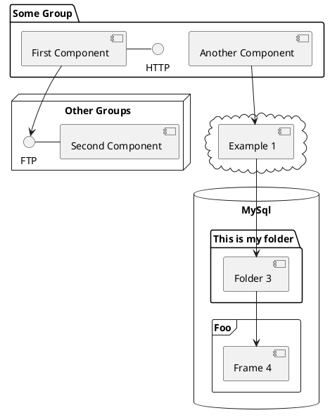

---
# try also 'default' to start simple
theme: seriph
colorSchema: light
# random image from a curated Unsplash collection by Anthony
# like them? see https://unsplash.com/collections/94734566/slidev
background: 
#background: https://cover.sli.dev
# apply any unocss classes to the current slide
class: 'text-center'
# https://sli.dev/custom/highlighters.html
highlighter: shiki
# some information about the slides, markdown enabled
info: |
  ## Slidev Starter Template
  Presentation slides for developers.

  Learn more at [Sli.dev](https://sli.dev)
transition: slide-left
title: Zero- and Few-Shots Knowledge Graph Triplet Extraction with Large Language Models
mdc: true
---

## Zero- and Few-Shots Knowledge Graph Triplet Extraction with Large Language Models

**Andrea Papaluca**, Daniel Krefl, Sergio Mendez Rodriguez, Artem Lensky, Hanna Suominen


<div class="abs-br m-6 flex gap-2">
  <a href="https://github.com/BrunoLiegiBastonLiegi/KG-TE-with-LLMs" target="_blank" alt="GitHub" title="Open in GitHub"
    class="text-xl slidev-icon-btn opacity-50 !border-none !hover:text-white">
    <carbon-logo-github />
  </a>
</div>

---

# Triplet Extraction

#### <p style="text-align: center;"> The 44th president of the US, Obama, was born in Honolulu, Hawaii, in 1961. </p>

<div v-click="1">



- (USA, president, Barack Obama)
- (Barack Obama, birthdate, 1961)
- (Barack Obama, birthplace, Honolulu)
- (Honolulu, located_in, Hawaii)

</div>

<div v-click="2">

$$
\rm{(unstructured)}\;\rm{Text}\longrightarrow \rm{Knowledge\;Graph}\;\rm{(structured)}
$$

</div>

---

# Triplet Extraction

<br>

SOTA &rarr; *End-to-End* supervised models 

&emsp; &rarr; Need labeled data <br>
&emsp; &rarr; Trained on a closed set of entities and relations <br>
&emsp; &rarr; Incapable of handling *OOD* instances <br>


<div v-click="1">

Large Language Models (LLM) &rarr; *In-context* learning

&emsp; &rarr; No training or finetuning necessary <br>
&emsp; &rarr; Zero-Shot: no data, internal knowledge alone <br>
&emsp; &rarr; Few-Shots: a handful of examples <br>
&emsp; &rarr; Capable of handling *OOD* instances <br>


</div>

<br> 

<div v-click="2">

### <p style="text-align: center;"> How competitive are they?</p>

</div>

---

# LLM prompting

<div class="grid grid-cols-2 gap-4">
<div>

### <p style="text-align: center;"> Zero-Shot </p>

</div>

<div>

### <p style="text-align: center;"> 2-Shots </p>


</div>

</div>

---

# Zero and 2-Shots TE

<div class="grid grid-cols-[500px_400px] gap-8">
<div>

| **Model** | | **WebNLG** | | **NYT** | |
| - | - | - | - | - | - |
|  | | *0-Shot* | *2-Shots* | *0-Shot* | *2-Shots* |
| **GPT2** | *base* | 0.000 | 0.006 | 0.000 | 0.000 |
| | *xl* | 0.000 | 0.037 | 0.000 | 0.000 |
| **Falcon** | *7b* | 0.000 | 0.066 | 0.000 | 0.002 |
| | *40b* | 0.021 | 0.158 | 0.000 | 0.007 |
| **LLaMA** | *13b* | 0.006 | 0.129 | 0.000  |0.002 |
| | *65b* | 0.041 | **0.219** | 0.000 | **0.017** |

</div>
<div>

<div v-click="1">

| **Model** | **WebNLG** | **NYT** |
| - | - | - |
| NovelTagging | 0.283 | 0.420 | 
| CopyRE | 0.371 | 0.587 |
| GraphRel | 0.429 | 0.619 |
| OrderCopyRE | 0.616 | 0.721 |
| UniRel | **0.947** | **0.937** | 

<p style="text-align: center;"> &#8593; </p>

### <p style="text-align: center;"> Fully trained </p>

</div>

</div>
</div>

---

# KB aided TE


---

# Welcome to Slidev

Presentation slides for developers

<div class="pt-12">
  <span @click="$slidev.nav.next" class="px-2 py-1 rounded cursor-pointer" hover="bg-white bg-opacity-10">
    Press Space for next page <carbon:arrow-right class="inline"/>
  </span>
</div>

<div class="abs-br m-6 flex gap-2">
  <button @click="$slidev.nav.openInEditor()" title="Open in Editor" class="text-xl slidev-icon-btn opacity-50 !border-none !hover:text-white">
    <carbon:edit />
  </button>
  <a href="https://github.com/slidevjs/slidev" target="_blank" alt="GitHub" title="Open in GitHub"
    class="text-xl slidev-icon-btn opacity-50 !border-none !hover:text-white">
    <carbon-logo-github />
  </a>
</div>

<!--
The last comment block of each slide will be treated as slide notes. It will be visible and editable in Presenter Mode along with the slide. [Read more in the docs](https://sli.dev/guide/syntax.html#notes)
-->

---
transition: fade-out
---

# What is Slidev?

Slidev is a slide maker and accompanying presentation tool designed for developers. It consists of the following features:

- 📝 **Text-based** - focus on the content with Markdown, and apply styles later
- 🎨 **Themable** - themes can be shared and used as npm packages
- 🧑‍💻 **Developer Friendly** - code highlighting, live coding with autocompletion
- 🤹 **Interactive** - embedding Vue components to enhance your slides
- 🎥 **Recording** - built-in recording and camera view
- 📤 **Portable** - export to PDF, PPTX, PNGs, or even a hostable SPA
- 🛠 **Hackable** - virtually anything that's possible on a webpage is possible in Slidev

<br>
<br>

Read more about Slidev in [Why Slidev?](https://sli.dev/guide/why)

<!--
You can have `style` tags in markdown to override the style for the current page.
Learn more: https://sli.dev/guide/syntax#embedded-styles
-->

<style>
h1 {
  background-color: #2B90B6;
  background-image: linear-gradient(45deg, #4EC5D4 10%, #146b8c 20%);
  background-size: 100%;
  -webkit-background-clip: text;
  -moz-background-clip: text;
  -webkit-text-fill-color: transparent;
  -moz-text-fill-color: transparent;
}
</style>

<!--
Here is another comment.
-->

---
layout: default
---

# Table of contents

```html
<Toc minDepth="1" maxDepth="1"></Toc>
```

<Toc maxDepth="1"></Toc>

---
transition: slide-up
level: 2
---

# Navigation

Hover on the bottom-left corner to see the navigation's control panel, [learn more](https://sli.dev/guide/navigation.html)

## Keyboard Shortcuts

|     |     |
| --- | --- |
| <kbd>right</kbd> / <kbd>space</kbd>| next animation or slide |
| <kbd>left</kbd>  / <kbd>shift</kbd><kbd>space</kbd> | previous animation or slide |
| <kbd>up</kbd> | previous slide |
| <kbd>down</kbd> | next slide |

<!-- https://sli.dev/guide/animations.html#click-animations -->

<p v-after class="absolute bottom-23 left-45 opacity-30 transform -rotate-10">Here!</p>

---
layout: image-right
image: https://cover.sli.dev
---

# Code

Use code snippets and get automatic highlighting, and even types hover![^1]

```ts {all|5|7|7-8|10|all} twoslash
// TwoSlash enables TypeScript hover information
// and errors in markdown code blocks
// More at https://shiki.style/packages/twoslash

import { computed, ref } from 'vue'

const count = ref(0)
const doubled = computed(() => count.value * 2)

doubled.value = 2
```

<arrow v-click="[4, 5]" x1="350" y1="310" x2="195" y2="334" color="#953" width="2" arrowSize="1" />

<!-- This allow you to embed external code blocks -->
<!-- <<< @/snippets/external.ts#snippet -->

<!-- Footer -->
[^1]: [Learn More](https://sli.dev/guide/syntax.html#line-highlighting)

<!-- Inline style -->
<style>
.footnotes-sep {
  @apply mt-5 opacity-10;
}
.footnotes {
  @apply text-sm opacity-75;
}
.footnote-backref {
  display: none;
}
</style>

---

# Components

<div grid="~ cols-2 gap-4">
<div>

You can use Vue components directly inside your slides.

We have provided a few built-in components like `<Tweet/>` and `<Youtube/>` that you can use directly. Adding your own custom components is also super easy.

```html
<Counter :count="10" />
```

<!-- ./components/Counter.vue -->
<Counter :count="10" m="t-4" />

Check out [the guides](https://sli.dev/builtin/components.html) for more.

</div>
<div>

```html
<Tweet id="1390115482657726468" />
```

<Tweet id="1390115482657726468" scale="0.65" />

</div>
</div>

<!--
Presenter notes with **bold**, *italic*, and ~~strike~~ text.

Also, HTML elements are valid:
<div class="flex w-full">
  <span style="flex-grow: 1;">Left content</span>
  <span>Right content</span>
</div>
-->

---
class: px-20
---

# Themes

Slidev comes with powerful theming support. Themes can provide styles, layouts, components, or even configurations for tools. Switch between themes on a per-slide basis with just **one change** in your frontmatter:

<div grid="~ cols-2 gap-2" m="t-2">

```yaml
---
theme: default
---
```

```yaml
---
theme: seriph
---
```


</div>

Read more about [How to use a theme](https://sli.dev/themes/use.html) and
check out the [Awesome Themes Gallery](https://sli.dev/themes/gallery.html).

---
preload: false
---

# Animations

Animations are powered by [@vueuse/motion](https://motion.vueuse.org/).

```html
<div
  v-motion
  :initial="{ x: -80 }"
  :enter="{ x: 0 }">
  Slidev
</div>
```

<div class="w-60 relative mt-6">
  <div class="relative w-40 h-40">
    
    
    
  </div>

  <div
    class="text-5xl absolute top-14 left-40 text-[#2B90B6] -z-1"
    v-motion
    :initial="{ x: -80, opacity: 0}"
    :enter="{ x: 0, opacity: 1, transition: { delay: 2000, duration: 1000 } }">
    Slidev
  </div>
</div>

<!-- vue script setup scripts can be directly used in markdown, and will only affect the current page -->
<script setup lang="ts">
const final = {
  x: 0,
  y: 0,
  rotate: 0,
  scale: 1,
  transition: {
    type: 'spring',
    damping: 10,
    stiffness: 20,
    mass: 2
  }
}
</script>

<div
  v-motion
  :initial="{ x:35, y: 40, opacity: 0}"
  :enter="{ y: 0, opacity: 1, transition: { delay: 3500 } }">

[Learn More](https://sli.dev/guide/animations.html#motion)

</div>

---

# LaTeX

LaTeX is supported out-of-box powered by [KaTeX](https://katex.org/).

<br>

Inline $\sqrt{3x-1}+(1+x)^2$

Block
$$ {1|3|all}
\begin{array}{c}

\nabla \times \vec{\mathbf{B}} -\, \frac1c\, \frac{\partial\vec{\mathbf{E}}}{\partial t} &
= \frac{4\pi}{c}\vec{\mathbf{j}}    \nabla \cdot \vec{\mathbf{E}} & = 4 \pi \rho \\

\nabla \times \vec{\mathbf{E}}\, +\, \frac1c\, \frac{\partial\vec{\mathbf{B}}}{\partial t} & = \vec{\mathbf{0}} \\

\nabla \cdot \vec{\mathbf{B}} & = 0

\end{array}
$$

<br>

[Learn more](https://sli.dev/guide/syntax#latex)

---

# Diagrams

You can create diagrams / graphs from textual descriptions, directly in your Markdown.

<div class="grid grid-cols-4 gap-5 pt-4 -mb-6">









</div>

[Learn More](https://sli.dev/guide/syntax.html#diagrams)

---
layout: center
class: text-center
---

# Learn More

[Documentation](https://sli.dev) · [GitHub](https://github.com/slidevjs/slidev) · [Showcases](https://sli.dev/showcases.html)
